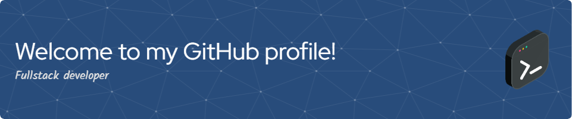

<!--
**FabriceAtlan/FabriceAtlan** is a ✨ _special_ ✨ repository because its `README.md` (this file) appears on your GitHub profile.

Here are some ideas to get you started:

- 🔭 I’m currently working on ...
- 🌱 I’m currently learning ...
- 👯 I’m looking to collaborate on ...
- 🤔 I’m looking for help with ...
- 💬 Ask me about ...
- 📫 How to reach me: ...
- 😄 Pronouns: ...
- ⚡ Fun fact: ...
-->

  
  

# À propos de moi

Depuis toujours passionné par la programmation informatique, j'ai commencé mon apprentissage avec Visual Basic et Visual Basic for Applications. Quelques années plus tard, j'ai découvert le HTML et le CSS en étudiant les fichiers EPUB de ma liseuse Kobo. Cette nouvelle passion m'a poussé à élargir mes compétences et à me lancer dans divers projets. Lors de mon dernier poste en tant que chargé d'amélioration continue chez Safran Transmissions Systems, j'ai développé plusieurs petites applications d'automatisation des tâches.

Ma curiosité m'a ensuite conduit à découvrir le développement de jeux vidéo, et j'ai réalisé qu'il était possible de programmer des jeux par soi-même avec des langages de haut niveau. J'ai alors rejoint l'école GameCodeur, où j'ai appris le langage LUA et le framework 2D Löve2D.

Cependant, c'est le développement web qui m'attirait toujours autant. C'est pourquoi j'ai décidé de créer ma micro-entreprise en mars 2024 pour me lancer pleinement dans ce domaine. J'ai rapidement trouvé une entreprise pour laquelle je réalise des projets d'intégration web, de refonte de pages et de développement en JavaScript.

Souhaitant aller plus loin, j'ai décidé en septembre 2024 de suivre une formation certifiante afin d'obtenir le titre RNCP de développeur web et web mobile.

Vous trouverez ici quelques-uns de mes projets, où je partage mon apprentissage et mes réalisations.

##  Quelques outils que j'utilise et apprends

  
  
  
  
  
  
  
  
  
  

